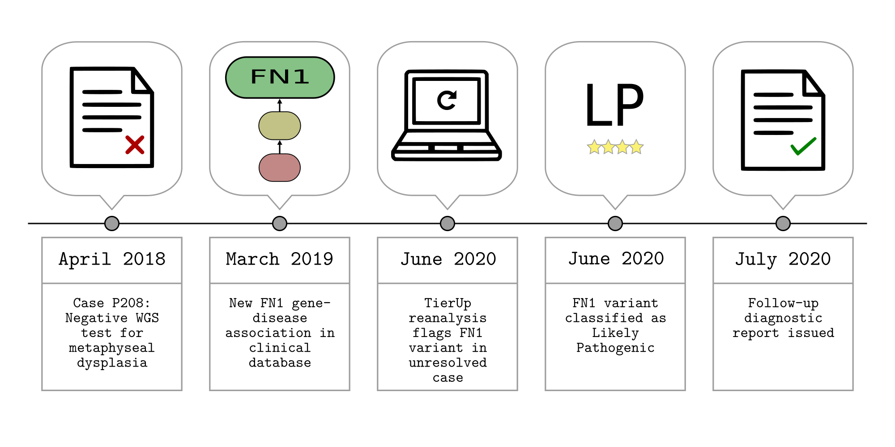
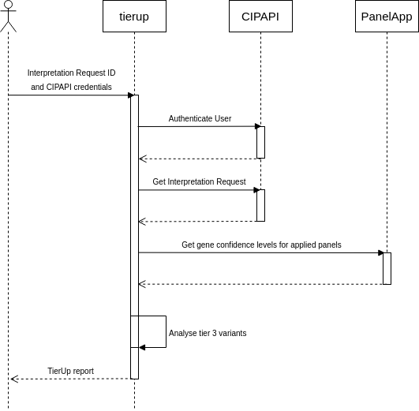

# Supplementary Materials

Reanalysis of unresolved rare disease cases using TierUp version 0.3.0.



## Source Data

* db.csv - Merged TierUp results for 948 anonymised cases
* Metadata parsed from TierUp input files using custom scripts:
    * cohort.csv - Number of patients recruited per case
    * rd_group_referrals.csv - Rare disease group referrals from all cases


## TierUp Reanalysis



TierUp takes GEL interpretation request JSON files as input. These files contain variants prioritised by the GEL tiering pipeline during the initial analysis. TierUp can also download the input files given a case identifier, provided the user is connected to the NHS Health and Social Care Network and has valid GeL CIP-API credentials. 

We processed all unresolved cases using the following command:
> time parallel tierup -c config.ini -j {} ::: *.jsons &> results.txt

This created `*.tierup.csv` files with the results for each case. Additionally, `results.txt` reported the time taken to process 948 cases on this machine:
```
real	76m43.785s
user	140m17.023s
sys	5m1.144s
```

## Creating db.csv

We combied TierUp reanalysis results files into a single CSV file using [csvstack](https://csvkit.readthedocs.io/en/0.9.1/scripts/csvstack.html). Patient identifiers were pseudonymed and any fields that were not required for publication were dropped.

## Analysis

Descriptive statistics are calculated from db.csv and accompanying files as recorded in the [analysis notebook](./analyses/tierup_results.ipynb).

## Files

The `/files` directory contains figures and data that were produced manually.